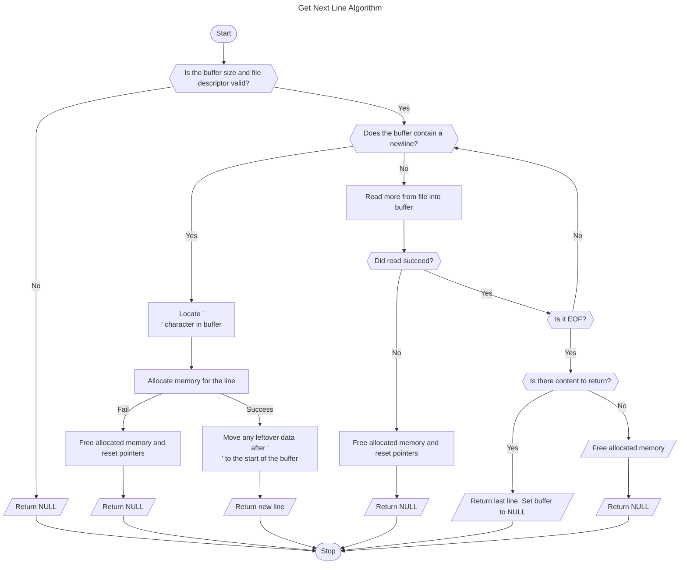

<picture>
  
</picture>

## Get Next Line

The Get Next Line project is a part of the [Hive Helsinki (42 School Network)](https://www.hive.fi/en/curriculum) core curriculum.  

 Function `get_next_line` helps to read a file descriptor one line at a time. It returns the line that was read, including the terminating `\n` character, except when reaching the end of the file without a new line. If there is nothing left to read or an error occurs, the function will return `NULL`.  
 
 The buffer size can be defined at compile time using the `-D BUFFER_SIZE` directive, allowing for flexible memory management.  

 ### Algorithm  
 The following diagram illustrates how the `get_next_line` function works:  

------

Made by Julia Persidskaia.  
[LinkedIn](https://www.linkedin.com/in/iuliia-persidskaia/)  
